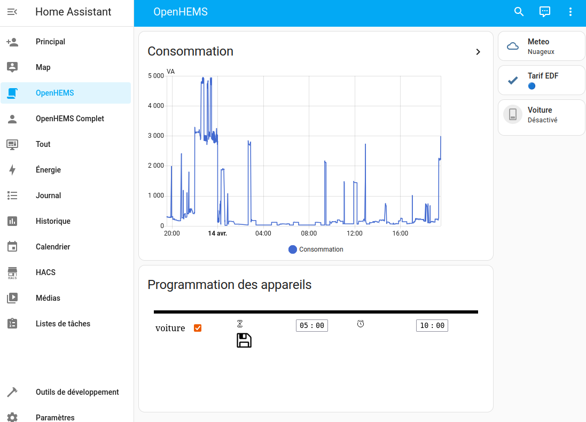

Usage
=====

In this paragraph we will see main use cases of OpenHEMS and how we can use it. We will introduce some notions.

When to choose OpenHEMS
-----------------------

If you have solar panel, OpenHEMS is an excellent choice to controll them in order to increase profitability.

If you don't have solar panel, you usually have devices you can manually programm. Maybe is it not necessary to set a complex home automation for this. But when there is lots of devices or if you have ever Home-Asistant installed (or would like to), OpenHEMS will empowered it.

Wat OpenHEMS is not
-------------------

Althought OpenHEMS can automate home energy management, there is no warantly there is no bugs so it could start/stop a device in a wrong moment. It is not safe enough for critical cases.

The system is not today very reactive. Common loop delay is 30 seconds and even if you put it to the minimum 1 seconds don't expect to react in less than 10 seconds. Reasons are Home-Assistant and home automation network as an approximativ 3 seconds reaction time. The server can suffer of slow down. The choice of the network architecture can impact too. For exemple Wi-Fi conection can go down for minutes.

Prerequisites
-------------

Different devices
-----------------

Human controlled devices
~~~~~~~~~~~~~~~~~~~~~~~~

This is devices witch usually we need to press a button. Instead of doing this, for those devices, OpenHEMS offer an interface in Home-Assistant (widget) to ask OpenHEMS to start it in the futur. This interface is accessible from any web brower (Firefox, Chromium, Safari...) and from the Android and iOS application Home-Assistant.

Today, OpenHEMS support 2 way to set up a switch node:

* With the widget/web interface, you can set a "duration" : how-long you want the device to be up. In that case, the system will switch on the device during the period of time but only during the optimal periods. So it can take time (up to 24h) to achieve it. It can be a problem. In that case, you can, if needed, specify a "timeout". If set, the system will ensure that the device will have been switched on during the "duration" period before the "timeout" occured. OpenHEMS will try to optimize the range.

* You can configure an appliance to be switched on at the best time until a condition occured.

Both methods can be used together. For example to charge a car at 80% usually, but once you set up a long "duration" to reach 100% because tomorow you will travel a lot.

This concern a waste majority of devices.

Automatical devices
~~~~~~~~~~~~~~~~~~~

This concern devices witch we want to be on depending on time or other existing parameters. We think to Wi-Fi who some want to switch off on night or to outside light whitch some want to switch on depending on sun rise. Some can be optionnal functionnality that we can switch off during higth load. We think to fountain or automatic mower (or vacuum cleaner) charge.

Retro-action controlled devices
~~~~~~~~~~~~~~~~~~~~~~~~~~~~~~~

This is devices witch can be controlled "automatically" by one or many sensor. It can be heating, fridge, Controlled Mechanical Ventilation (CMV).

For this there is usually an acceptable margin, with OpenHEMS we could play with this margin to reduce consumption. But there is few benefits to expect. The idea is to overload when there is electricity at low cost (or to much) and to let go down to minimum value at exepensive periods. The problem is that there is an overload during overload period witch is maybe not really economically interesting and maybe a loss of confort.

For each devices you will affect a "strategy". This strategy will decide when to start & stop it. There is some different kind of strategy. Lets explore it.

Different strategy
------------------

First, we class use cases depending on source power.

* With unpredictable source power but usually with a static cost. Typically with solar-panels or wind turbine.

* With predictable and reliable source of power but with a variable cost. Usually it's public power grid.

* For cases with predictable, reliable and fixed cost, OpenHEMS is less usefull except maybe to reduce some consumptions.

Offpeak strategy
~~~~~~~~~~~~~~~~

The offpeak strategy is for predictable sources. Usually it consist on a public power grid source with offpeak/peak hours. Usually it is fixed off-peak hours but we can imagine to change it. We can have more complex cases with variable costs.

For this we use "Offpeak" strategy. In this cases devices are start during offpeak range time. 

But some time ther is not enough time during offpeak periods to respect wanted time out. In this case, the system wil decide a minimum switch on during peak period at lower cost.

It happen the consumption run to higth (configured), for safety the system will suspend device.

Switchoff strategy
~~~~~~~~~~~~~~~~~~

This strategy is used for devices to switch on (or switch off) during a period depending time. We can configure to add conditions witch is usefull to switch off not neccessary devices on exceptionnal and critical cases (Hight cost or low battery)

Emhass strategy
~~~~~~~~~~~~~~~

The Emhass strategy is based on Emhass project. You can see his [documentation](https://emhass.readthedocs.io/en/latest/differences.html) for more informations.

Basically, this strategy is interesting when there is unpredictable power sources (like solar panels and/or battery).

In this cases, OpenHEMS will have to guess what should be the production and consumption to decide what to do and when. For this it uses Artificial Intelligence and based on history and meteo prediction, try to guess.
