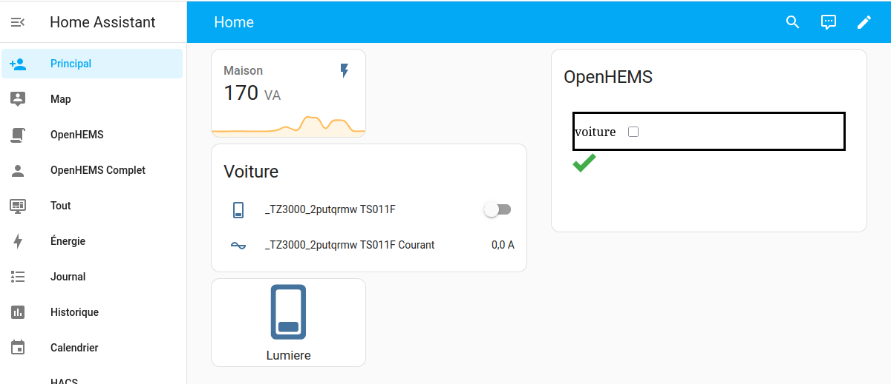
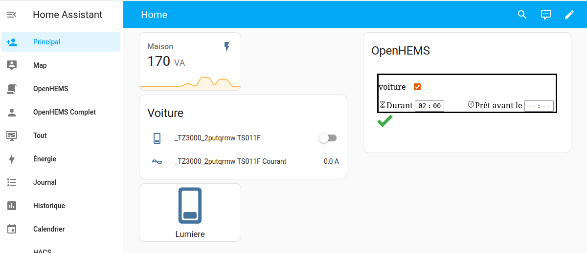

.. raw:: html
  

     
    
    <h1>OpenHEMS</h1>
    <strong>A simple Home Energy Management System</strong>
  

   
  

    
    
    
    
  

  

    
    
    
    
  

  

    
    
    
  

   
  

  If you like this work please consider buying a coffee ;-) 
  

  

    
  

Presentation
============

This software is an Open-Source Home Energy Management System based on [Home-Assistant](https://www.home-assistant.io/) installation. It all run locally witch is good for privacy and is customizable. It will launch heavy consumption appliance at the best time.

This software is usefull to get an as smart as possible management of power consumption and production. This should lead to cost reduction. 

* If you have a solar panel with battery, it will allow you to have smaller battery (witch is the most expensive part).

* If you have a public power grid source with variable cost, it will allow you to consume when it's lower cost.

Warning : This software is under activ developpment and is used on production but remain at early developpment.
All contribution to the software are welcome. Please contact contact@openhomesystem.com for any questions.

Overview
========

You could insert it in Home-Assistant like this.

And here we ask the "voiture" to start for 2 hours (Here configured in french).

Features
========

:white_check_mark: Easy installation and UI configuration with HTML pages\
:white_check_mark: Support multiple off-peak time-slots and even variable time-slots and cost (RTE Tempo contract).\
:white_check_mark: Usefull if you don't have solar panel but only a contract with off-peak.\
:white_check_mark: Support solar panel management with EMHASS using AI\
:white_check_mark: Support basic solar panel management without AI for no sell or no buy strategy.\
:white_check_mark: Home-Assistant widget to schedule devices (washing-machine, charging car... )\
:white_check_mark: Time-out for scheduled devices (to force run even if not good to get ready on time).\
:white_check_mark: Set the appliance to run automatically until X\
:white_check_mark: Set priority handling between multiple appliances\
:white_check_mark: Always check maximum capacities to avoid black-out\

We are expected to add soon the following features. We need beta-tester for those features. If you are interested, please contact us.

:x: Variable switch support (like solar router, wall-box)\
:x: Works with hybrid and standard inverters\

What OpenHEMS is not.

:warning: It will never guarantee a reaction time due to the performance of the home automation network and OpenHEMS (the worst is WiFi).\
:warning: Due to the licence, we do not garentee there is no bugs or problems. For garentee like this please contact us for a comercial support.\

Prerequisites
=============

* Controlable devices:

  * devices witch start on plug like electric-car or old washing machine.

  * connected devices like washing-machine.

* Advantages to delay some consumption. Depending on your electric source (Contract with offpeak hours, solar panels).

* A Linux based server, connected to home network, with a recent Python installation.

* And some software skills...

* More prerequisites, for installation are detailed on installation's documentation.

Install this software
=====================

It is integrate to Home-Assistant as an add-on on HAOS. Please in addon-modules add a store url "https://github.com/abriotde/openhems-addon". Then refresh the store annd click to add OpenHEMS.

Once install, you have to configure it. Open the "web interface" and choice "parameters" in the menu. There is a video, in French, to explain how to install and configure OpenHEMS on [Youtube](https://www.youtube.com/watch?v=1rb9n-XyTsM). You can to read the documentation (RTFM) the [documentation](https://openhems.readthedocs.io/en/latest/installation.html) or see example in `config/openhems.yaml` or `tests/data/*.yaml` or `src/openhems/data/openhems_default.yaml`. Please contact us if you have problems.

Once configured, you will add a tile in your Home-Asssitant dashboard. Add a web-page tile. To know the url, open the "web interface" of OpenHEMS and copy the URL and add "/?n=1" at end. You will obtain something like "http://192.168.1.202:8000/?n=1". You should just change "192.168.1.202" part.

Additional documentation
========================

- [Installation of Home-Assisant](https://www.home-assistant.io/installation/linux)
- [For those who want to developp](https://developers.home-assistant.io/docs/development_environment)
- [For those who will use "emhass" strategy](https://emhass.readthedocs.io/en/latest/)
